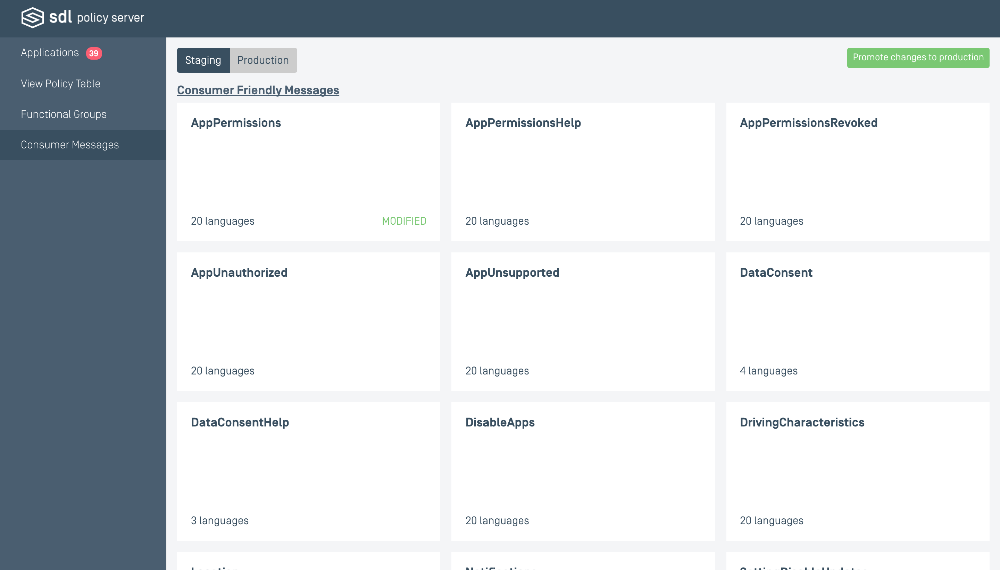
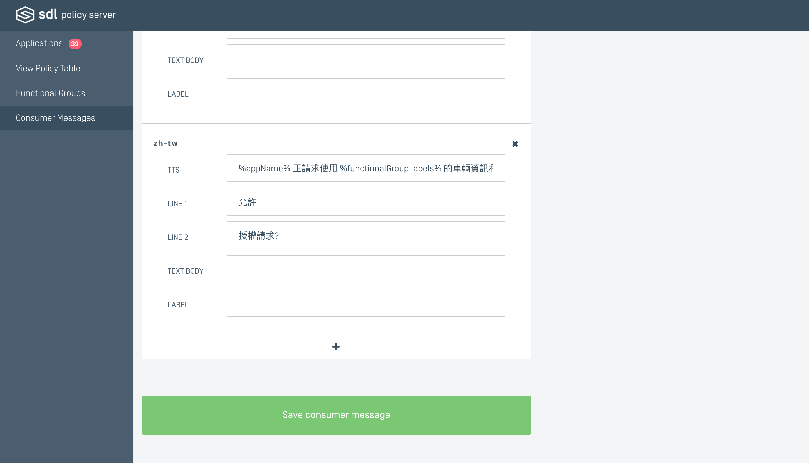
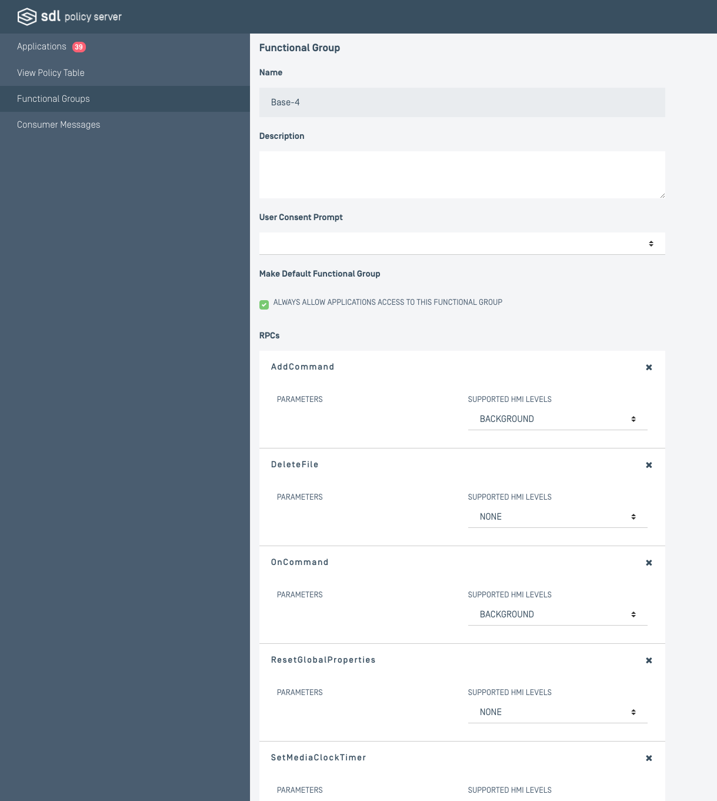
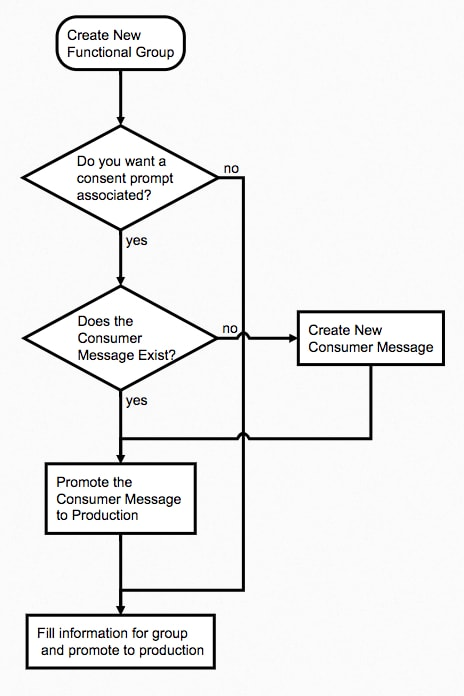
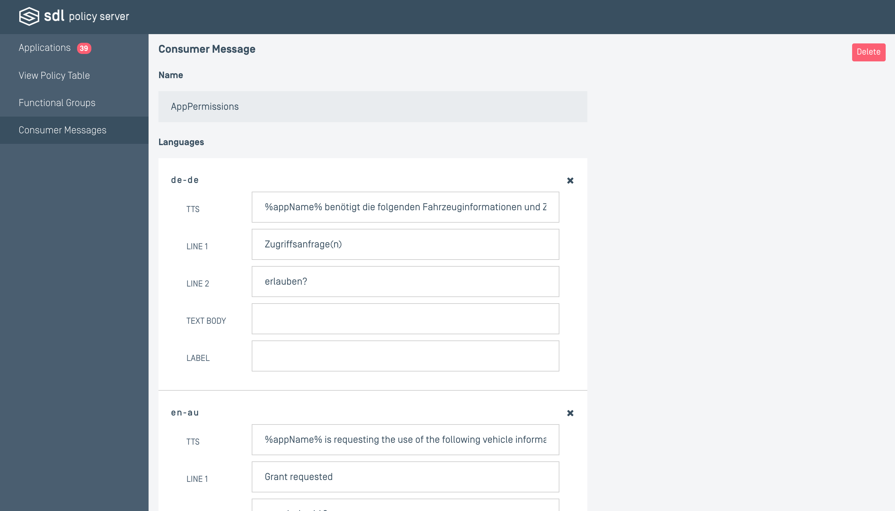

# Consumer Messages & Functional Groups
The pages for displaying lists of consumer messages and functional groups are structured in the same way, using similar Vue.js components. For information on the properties of the consumer messages and functional groups, refer back to the earlier documentation regarding the [Policy Table](/docs/sdl-server/master/policy-table/overview/).

## Cards
Each functional group or consumer message card will have identifying information displayed on a card. This information includes the name, and the number of permissions or languages. If the information in the card has been altered since the time of creation then it will have a "MODIFIED" tag. All cards are listed in alphabetical order by name.

### Editing
It should be noted that the cards under "Production" cannot be edited. If you wish to edit an existing functional group that has been set to "Production" then you must edit the staging version of that group. Remember to hit the save button at the bottom of the page to keep any changes.
 

## Functional Groups
| Property | Definition |
|----------|---------|
| Name | The String for which to identify the functional groups. |
| Description | A body of text to outline the permissions associated with this functional group. |
| User Consent Prompt | The consumer friendly message to be displayed when requesting input from the user. |
| Make Default Functional Group | If set to true, all approved applications will have access to this functional group and its permissions. |

### RPCs
| Property | Definition |
|----------|---------|
| Parameters | References possible vehicle information that can retrieved. This is only applicable to vehicle data RPCs. eg. GetVehicleData, SubscribeVehicleData |
| Supported HMI Levels | SDL Core interface display levels allowed by the app |

### Creating a New Functional Group
When creating a new functional group, first consider if there should be a user consent prompt associated with the group. If yes, the following diagram will walk through the correct steps.

## Consumer Messages
For information on the language object properties, refer back to the documentation on the <a href="/docs/sdl-server/master/policy-table/consumer-friendly-messages/">consumer messages</a> object.

## Staging
This environment is where temporary or unfinished entries reside. They can be edited and reworked.

## Production
Only promote an entry to production if you are certain that all information associated is correct and final. After promoting to production, changes can not be made to the entry and a new entry must be created for any alterations to be made.